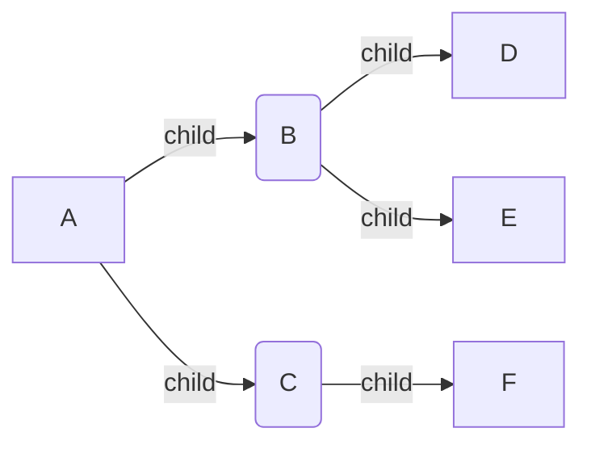

# belajar-golang-context


## Pengenalan Context
***
* Context merupakan sebuah data yang membawa value, sinyal cancel, sinyal timeout dan sinyal deadline
* Context biasanya dibuat per request (misal setiap ada request masuk ke server web melalui http request)
* Context digunakan untuk mempermudah kita meneruskan value, dan sinyal antar proses


## Kenapa Context Perlu Dipelajari
***
 - Context di Golang biasa digunakan untuk mengirim data request atau sinyal ke proses lain
 - Dengan menggunakan context, ketika kita ingin membatalkan semua proses, kita cukup mengirim sinyal ke context, maka secara otomatis semua proses akan dibatalkan
 - Hampir semua bagian di Golang memanfaatkan context, seperti database, http server, http client, dan lain-lain
 - Bahkan di Google sendiri, ketika menggunakan Golang, context wajib digunakan dan selalu dikirim ke setiap function yang dikirim

    
## Package Context
***
 - Context direpresentasikan di dalam sebuah interface Context
 - interface Context terdapat dalam package context
 - https://golang.org/pkg/context/ 
 

### Interface Context
 ```go
 type Context interface {
	
 DeadLine() (deadline time.Time, ok bool
 
 Done() <-chan struct{}
 
 Err() error
 
 Value(key interface{}) interface{}
}
```

### Membuat Context
- Karena Context adalah sebuah interface, untuk membuat context kita butuh sebuah struct yang sesuai dengan kontrak interface Context
- Namun kita tidak perlu membuatnya secara manual
- Di Golang package context terdapat function yang bisa kita gunakan untuk membuat Context

#### Function Membuat Context
| Function         | Keterangan             |
|------------------|------------------------|
| context.Background() | Membuat context kosong. Tidak pernah dibatalkan, tidak pernah timeout, dan tidak memiliki value apapun. Biasanya digunakan di main function atau dalam test, atau dalam awal proses request terjadi.|
| context.TODO() |   Membuat context kosong seperti Background(), namun biasanya menggunakan ini ketika belum jelas context apa yang ingin digunakan|
```go
func TestContext(t *testing.T) {
	background := context.Background()
	fmt.Println(background)

	todo := context.TODO()
	fmt.Println(todo)
}
```
#### Diagram Parent dan Child Context

#### Hubungan Antara Parent dan Child Context
- Parent dan Child context akan selalu terhubung
- Saat nanti kita melakukan misal pembatalan context A, maka semua child dan sub child dari context A akan ikut dibatalkan
- Namun jika misal kita membatalkan context B, hanya context B dan semua child dan sub child nya yang dibatalkan, parent context B tidak akan ikut dibatalkan
- Begitu juga nanti saat kita menyisipkan data ke dalam context A, semua child dan sub child nya bisa mendapatkan data tersebut
- Namun jika kita menyisipkan data di context B, hanya context B dan semua child dan sub child nya yang mendapat data, parent context B tidak akan mendapat data
